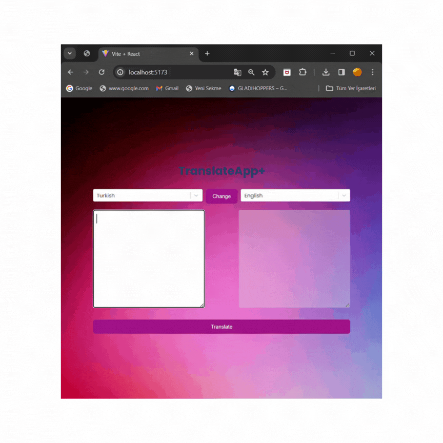

# toolkit_thunk_translate

## home page

💻 A translate project created using Redux Toolkit and Redux Thunk allows users to translate texts into different languages and performs this process asynchronously in the background. This project is typically utilized as part of larger-scale multilingual applications.

📗 User Interface (UI): The user is presented with an interface where they can enter the text they want to translate. This interface includes fields for the user to select the source language, the target language for translation, and an area to view the translation result.

📘 Redux Store: The Redux store, created using Redux Toolkit, manages the application state. This state includes the languages selected by the user, translation results, and other relevant information.

📙 Redux Thunk: Redux Thunk is used to manage asynchronous operations. Asynchronous tasks such as making API requests to perform translations and processing the received data are handled through Redux Thunk, dispatching actions to update the Redux store.

📊 API Requests: The text entered by the user along with their language selections are sent to an API. The API translates the text from the selected source language to the target language and returns the result.

📉 Redux Reducers: Redux reducers are utilized to update the Redux store's state. Translation results received from the API are added to the store via reducers and displayed in the user interface.

📈 User Feedback: The translated result is shown to the user. The user can choose to copy the translation or initiate another translation if desired.

